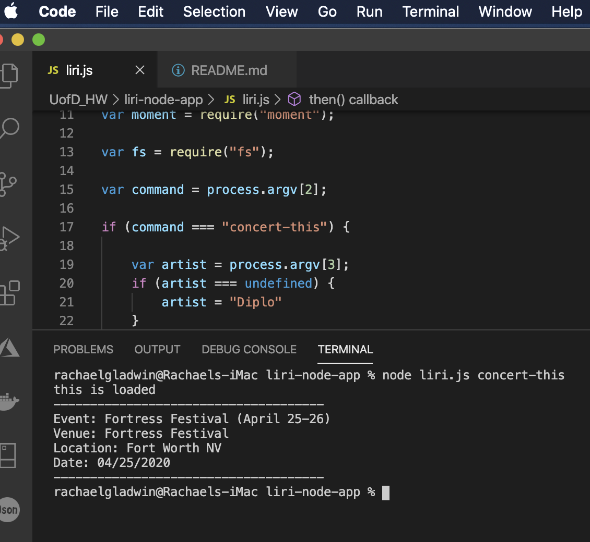
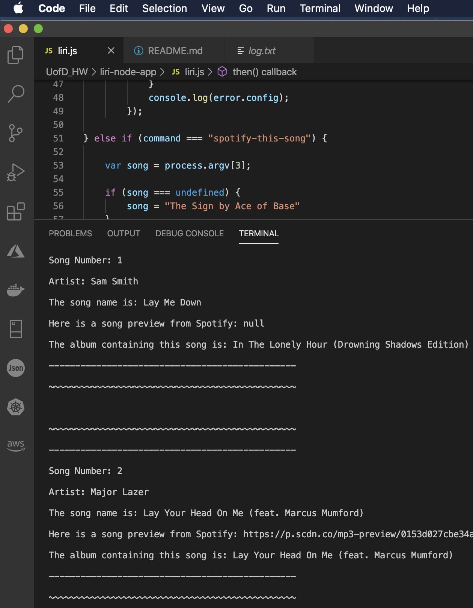
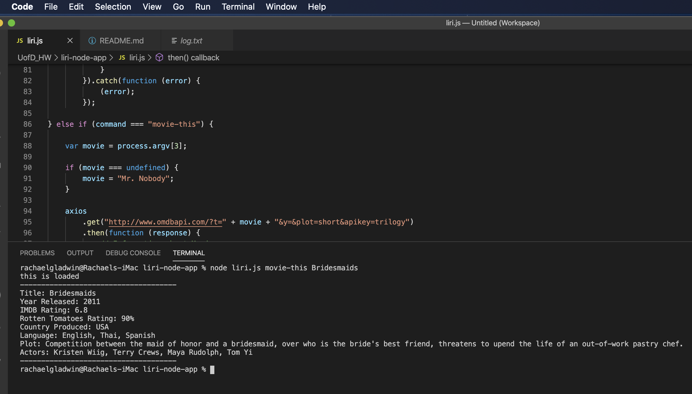
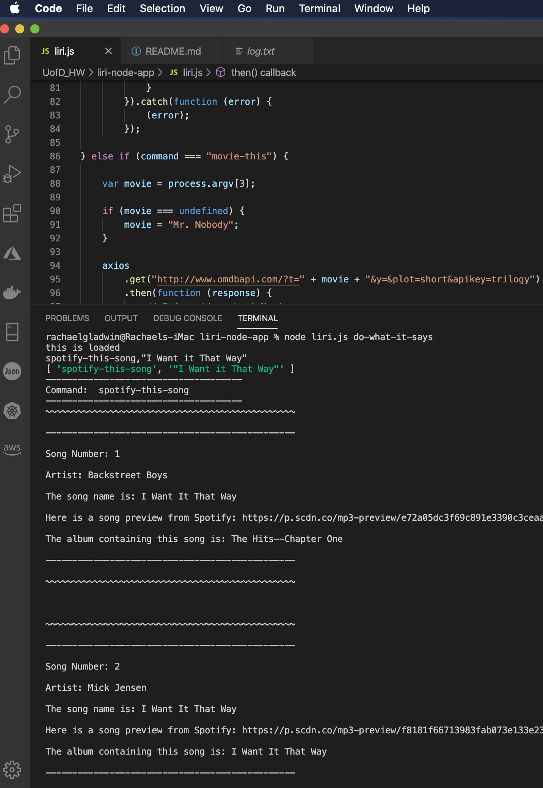

# liri-node-app

<h1>Liri is a command line application that allows the user to operate several functions. <h1>

<ul> 
<h2>CLI Functions</h2>
<li>concert-this</li>
<li>spotify-this-song</li>
<li>movie-this</li>
<li>do-what-it-says</li>
</ul>

<ul> 
<h3>concert-this</h3>
<li>Allows the user to pull up events by artists name.</li>
<li>If no value is entered it defaults to a stored artist.</li>
<li> 
</li>
</ul>

<ul> 
<h3>spotify-this-song</h3>
<li>Allows the user to pull up events by song name.</li>
<li>If no value is entered it defaults to a stored song.</li>
<li> 
</li>
</ul>

<ul> 
<h3>movie-this</h3>
<li>Allows the user to pull up movie data by the name of the movie.</li>
<li>If no value is entered it defaults to a stored movie.</li>
<li> 
</li>
</ul>

<ul> 
<h3>do-what-it-says</h3>
<li>Wildcard. Runs through all present functions.</li>
<li>No values necessary this entry has magic of its own.</li>
<li> 
</li>
</ul>

